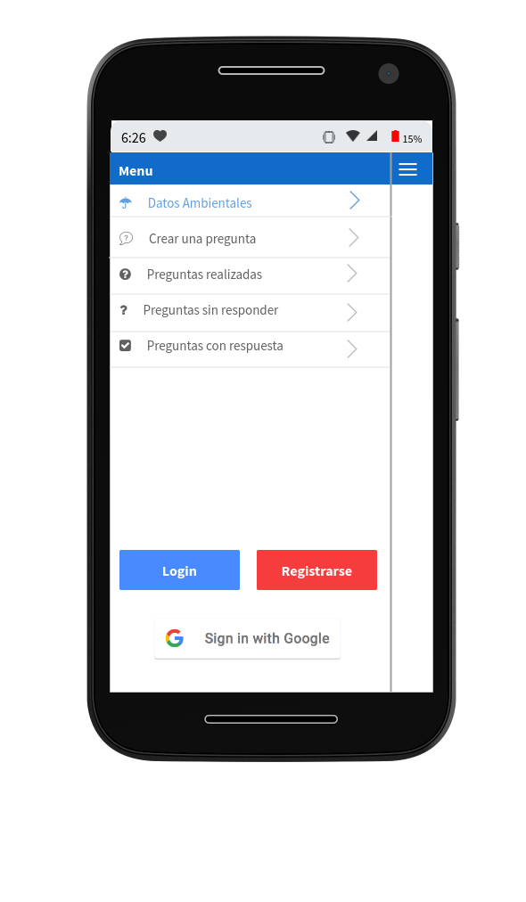
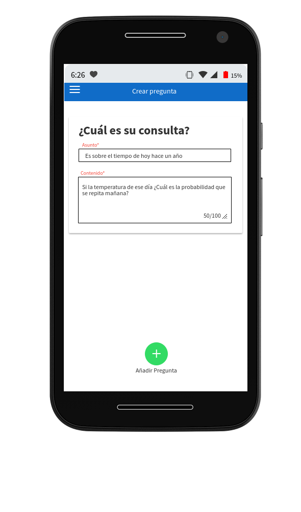
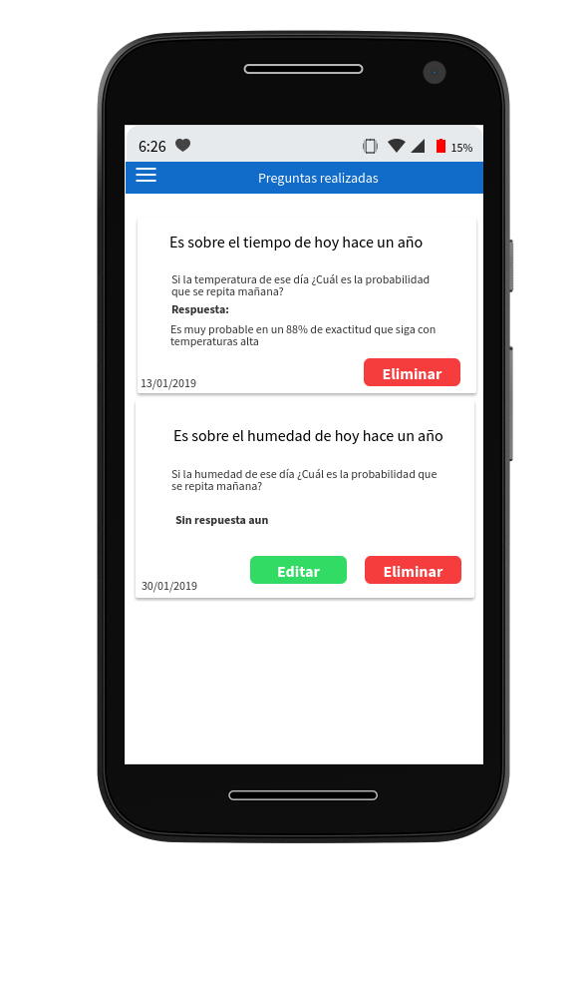

Mockups (Diseños de interfaces)
=================================
Los Mock Ups son fotomontajes que permiten a los diseñadores gráficos y web mostrar al cliente cómo quedaran sus diseños.

Mockups Usuario Movil
--------------------------
--------------------------
1.-Mockup menú
--------------------------

--------------------------
2.-Mockup graficos
--------------------------
.. image:: images2/M-GRAFICOS.png
    :scale: 50 %
    :align: center
--------------------------
3.-Mockup crearPregunta
--------------------------

    --------------------------
4.-Mockup preguntas realizadas
--------------------------

--------------------------
5.-Mockup mensajes sin contestas
--------------------------
.. image:: images2/M-SIN.png
    :scale: 50 %
    :align: center
--------------------------
6.-Mockup graficos
--------------------------
.. image:: images2/M-CONTES.png
    :scale: 50 %
    :align: center

Mockups Usuario Web
--------------------------

Mockups Usuario Administrador
--------------------------
