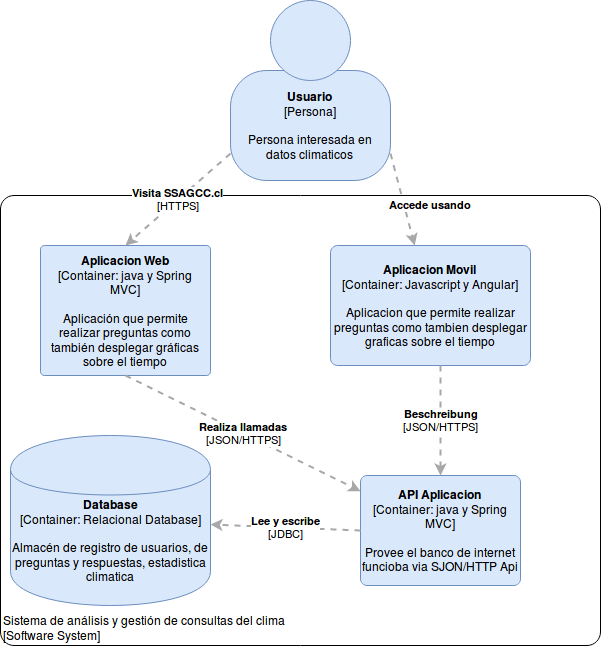
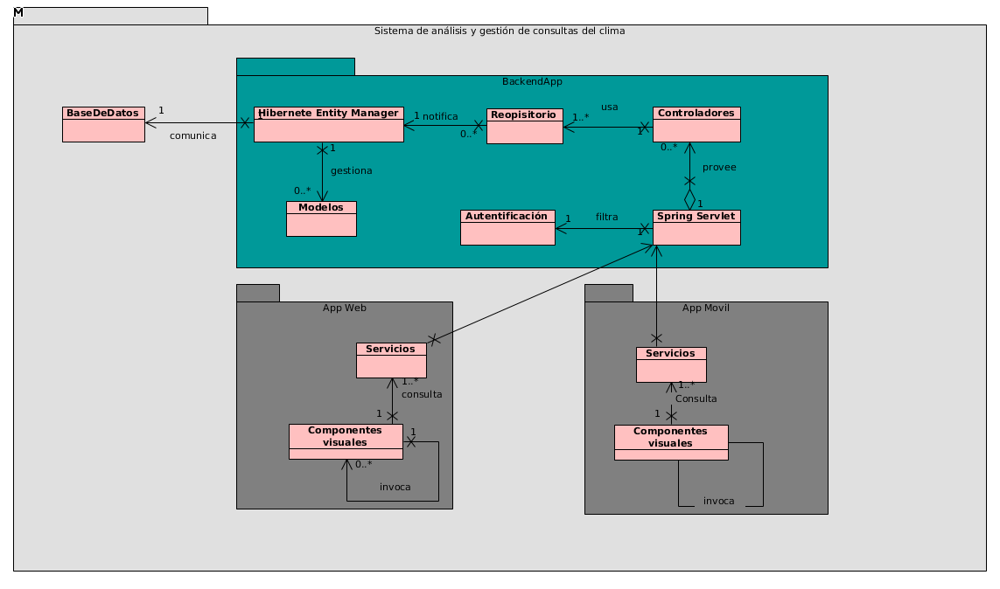
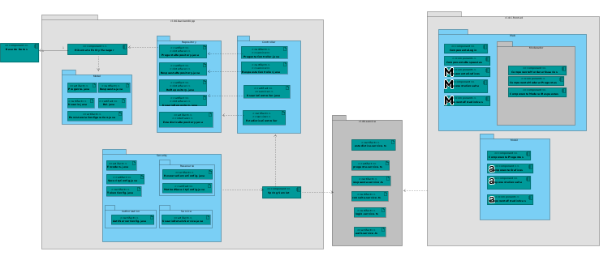
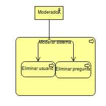
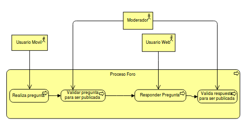
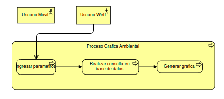
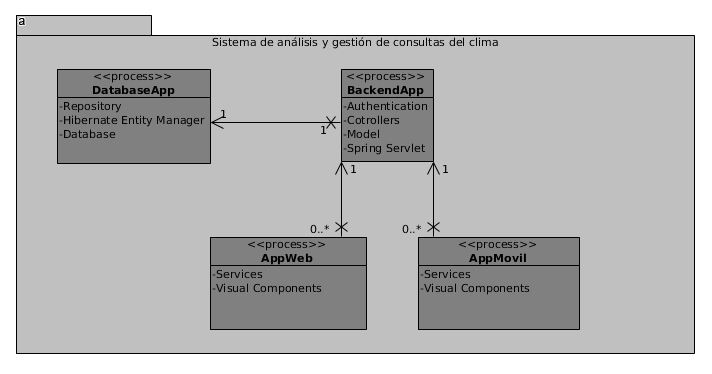
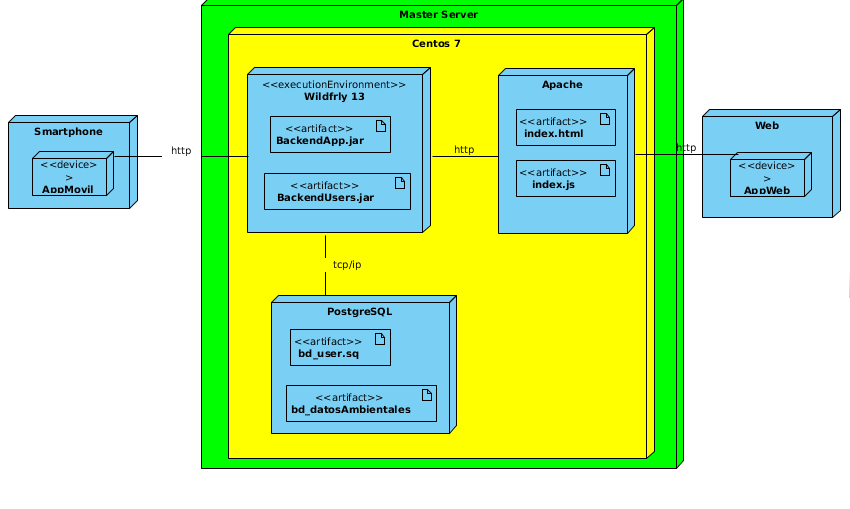

Estructura del sistema
=================================
Vista general
--------------------------

--------------------------
  Modelo C4
--------------------------

--------------------------
  Modelo UML
--------------------------

    
Vista desarrollo UML
--------------------------

    
Vista Procesos
--------------------------
--------------------------
Proceso moderar(Archimate)
--------------------------

    
--------------------------
Proceso foro(Archimate)
--------------------------

    
--------------------------
Proceso grafica(Archimate)
--------------------------

--------------------------
Proceso UML
--------------------------

    
Vista Fisica
--------------------------

