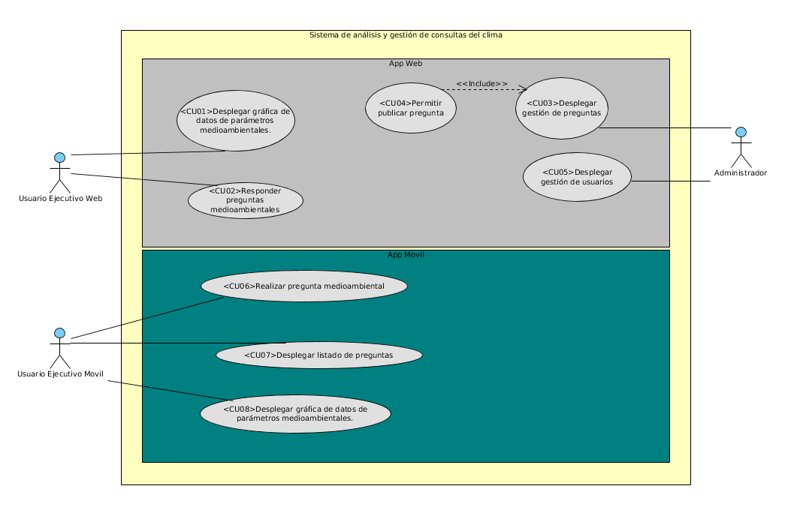

Comportamiento dinamico del sistema
=================================

Especificacion de escenarios
--------------------------

Descripción casos de uso
--------------------------

ACT - <01> 	Visitante Web
Descripción 	Corresponde al visistante web que accede a la información sobre paramestros medioambientales y responder preguntas en el sistema web.
ACT - <02> 	Visitante Móvil
Descripción 	Corresponde al visitante movil que accede para realizar preguntas.
ACT - <03> 	Visitante Moderador
Descripción 	Corresponde al usuario que accede para filtrar las preguntas y las respuestas de los demas visitantes.
<html>
    <head>
        <title>Ejemplo de tabla sencilla</title>
    </head>
    <body>
        <h1>Listado de cursos</h1>
        <table>
        <tr>
          <td><strong>Curso</strong></td>
          <td><strong>Horas</strong></td>
          <td><strong>Horario</strong></td>
        </tr>
        <tr>
          <td>CSS</td>
          <td>20</td>
          <td>16:00 - 20:00</td>
        </tr>
        <tr>
          <td>HTML</td>
          <td>20</td>
          <td>16:00 - 20:00</td>
        </tr>
        <tr>
          <td>Dreamweaver</td>
          <td>60</td>
          <td>16:00 - 20:00</td>
        </tr>
        </table>
    </body>
</html>
