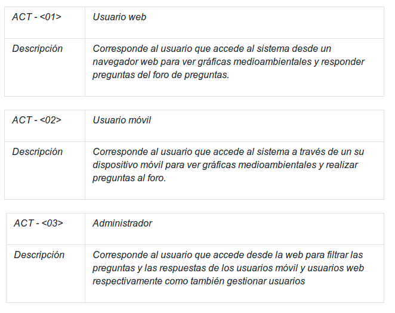
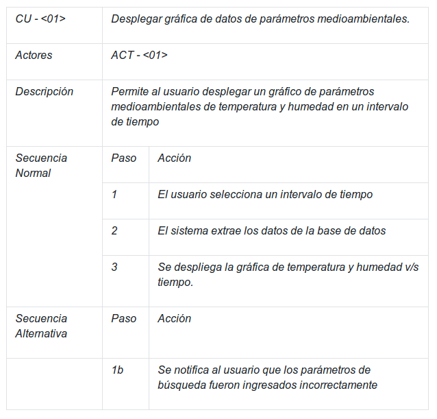
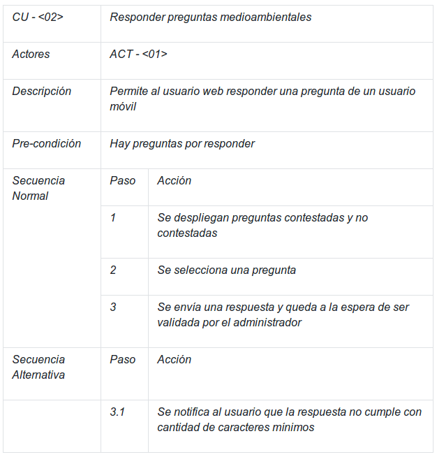
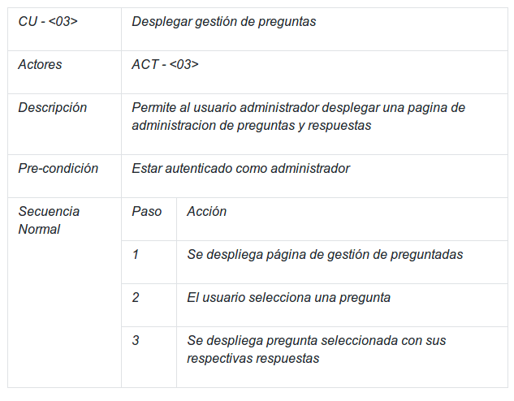
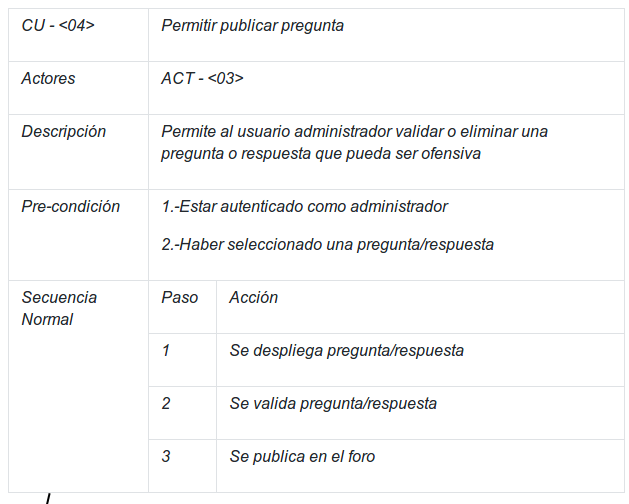
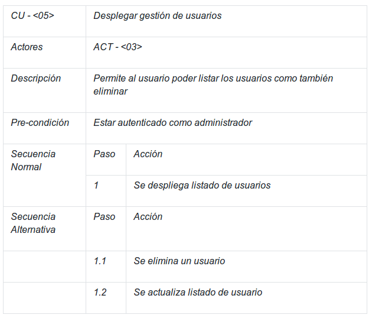
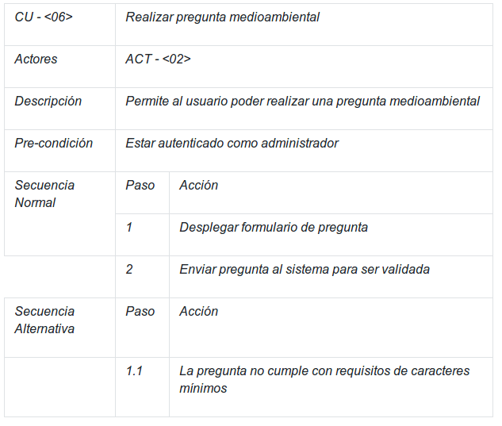
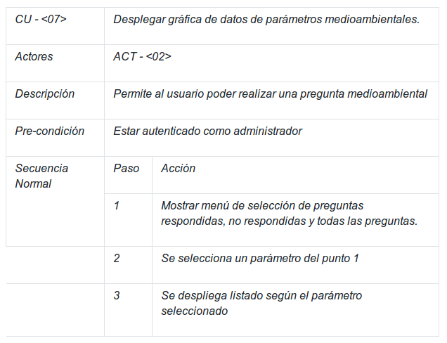
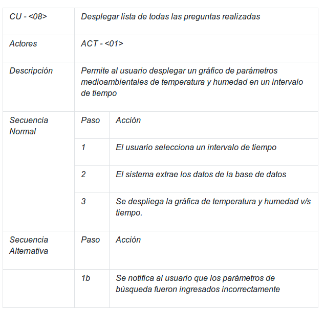

Comportamiento dinamico del sistema
=================================

Especificacion de escenarios
--------------------------

.. image:: images2/CASOSDEUSO.png
    :scale: 70 %
    :align: center

Descripción casos de uso
--------------------------
--------------------------
Actores
--------------------------

    
--------------------------
Casos de Uso
--------------------------

    

    

    

    

    

    

