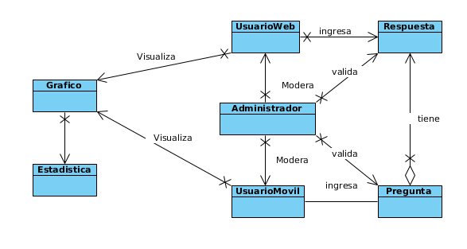

Marco conceptual
=================================

Diagrama de lexico
--------------------------

Estadistica: Consiste en un registro que graba información de temperatura y humedad en un momento específico de tiempo.
Gráfico: Es un gráfico de interpolación que muestra variaciones de medidas entre un rango de tiempo.
Pregunta: Es una pregunta sobre el clima, que puede ser creada por cualquier tipo de usuario.
Respuesta: Es un registro que puede ser creado por cualquier tipo de usuario, para poder responder una pregunta.
Administrador: Un tipo de usuario que puede gestionar las cuentas de usuario del sistema, y moderar/sancionar preguntas y respuestas indebidas.
Usuario Web: usuario corriente que accede al sistema a traves del navegador.
Usuario Movil: usuario corriente que a ccede al sistema a travez de un dispositivo movil.
